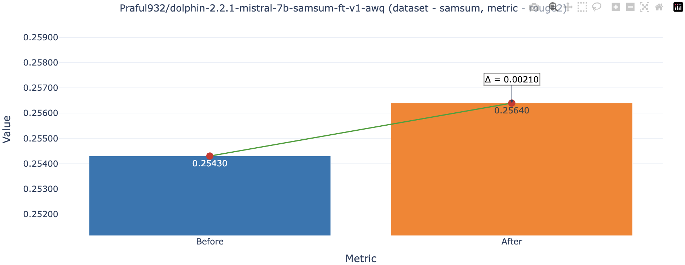

# llmsearch

[](https://llmsearch.netlify.app/)
[](https://hits.seeyoufarm.com)

Conduct hyperparameter search over generation parameters of large language models (LLMs). This tool is designed for ML practitioners looking to optimize their sampling strategies to improve model performance. Simply provide a model, dataset, and performance metric, llmsearch handles the rest.

[Release blog](https://praful932.dev/blog-4-llmsearch/)

## Contents
- [Installation](#installation)
- [Getting Started](#getting-started)
    - [QuickStart](#quickstart) - A notebook to get you started quickly
    - [End-to-End Model Examples](#end-to-end-model-examples) - Detailed Examples with specific models & datasets
- [Recommendations](#recommendations) - Best practises
- [Reproducibility](#reproducibility) - Ensuring consistent and reproducible results
- [Monkey Patches](#monkey-patches) - Key points to be aware of when using llmsearch
- [References](#references)


## Installation
The package works best with `python>=3.8.1`, `torch>=1.1` and `transformers>=4.27.4`. Hardware Stats from `pynvml` is used for caching batch size while running the search.
```
pip install llmsearch[pynvml]
```
If not running on a CUDA environment
```
pip install llmsearch
```

## Getting Started

### QuickStart
- [llama-3-8b Example](https://github.com/Praful932/llmsearch/blob/main/examples/llmsearch_quickstart.ipynb) [](https://colab.research.google.com/github/Praful932/llmsearch/blob/main/examples/llmsearch_quickstart.ipynb) - A quickstart notebook which shows the basic functionality of llmsearch. This notebook will help you understand how to quickly set up and run hyperparameter searches.

### End-to-End Model Examples
1. [GSM8K Example](https://github.com/Praful932/llmsearch/blob/main/examples/gsm8k_example.ipynb) - Shows a `GridSearchCV` ran on the [GSM8K](https://huggingface.co/datasets/gsm8k) Dataset using the `TheBloke/CapybaraHermes-2.5-Mistral-7B-AWQ` model.
2. [Samsum Example](https://github.com/Praful932/llmsearch/blob/main/examples/samsum_example.ipynb) - Shows a `GridSearchCV` ran on the [samsum](https://huggingface.co/datasets/samsum) Dataset
using a finetuned(on the same dataset) version of `cognitivecomputations/dolphin-2.2.1-mistral-7b`.




Table shows metrics as a result of the search from the e2e examples above. Before After shows the metric before and after running the hyperparameter search.

| Model                                                   | Dataset | Before  | After   | Samples | Metric    | Best Parameters                                                                                                                                                     | Metric File                                            |
|---------------------------------------------------------|---------|---------|---------|---------|-----------|---------------------------------------------------------------------------------------------------------------------------------------------------------------------|-------------------------------------------------------------|
| TheBloke/CapybaraHermes-2.5-Mistral-7B-AWQ              | gsm8k   | 54.5  | 55.25  | 500     | accuracy  | {'do_sample': True, 'generation_seed': 42, 'max_new_tokens': 500, 'no_repeat_ngram_size': 0, 'stopping_criteria': [<llmsearch.scripts.stopping_criteria.MultiTokenStoppingCriteria object at 0x7f8f9e357c40>], 'top_k': 10, 'top_p': 0.7} | [metric_file](https://github.com/Praful932/llmsearch/blob/main/examples/gsm-8k-best-params-500s-capybara-7b.json)  |
| Praful932/dolphin-2.2.1-mistral-7b-samsum-ft-v1-awq     | samsum  | 0.2543 | 0.2564 | 500     | rouge_2   | {'do_sample': True, 'generation_seed': 42, 'max_new_tokens': 70, 'no_repeat_ngram_size': 0, 'stopping_criteria': [<llmsearch.scripts.stopping_criteria.MultiTokenStoppingCriteria object at 0x7f3b38303610>], 'temperature': 0.1, 'top_k': 50}  | [metric_file](https://github.com/Praful932/llmsearch/blob/main/examples/samsum-best-params-500s-tune-capybara-7b.json)  |


## Recommendations
1. **Generative Tasks** : Searching for generation parameters is generally useful for tasks involving variable-length text outputs rather than tasks with constrained, discrete outputs. The impact of generation parameters on discrete outputs is very limited.
2. **Batch Size** : The right batch size can significantly influence model performance. Experiment with different sizes to find the optimal setting that balances speed and accuracy without excessive padding.
3. **Stopping Criteria** : Use stopping criteria while evaluating models so that the model does not endlessly generate tokens until `max_new_tokens` is reached. All of the examples in the repo use a [stopping criteria](https://github.com/Praful932/llmsearch/blob/main/llmsearch/scripts/stopping_criteria.py).

## Reproducibility
- Achieving consistent results is crucial, especially when comparing different hyperparameter settings.
- Quantization frameworks, such as `exllama`, are designed to significantly enhance inference speed at the cost of reduced reproducibility. However, `AWQ` is another quantization method that not only delivers high inference speed but also maintains a high degree of reproducibility. The e2e examples employ `AWQ`. Note that for certain applications where specific generation parameters are more critical than absolute reproducibility, `exllama` might still be preferable."
- To ensure reproducibility during the generation process, we've introduced a `generation_seed` parameter in the `model.generate` method of the transformers module via monkey patching. This parameter allows you to seed the model's output generation, ensuring that results can be consistently replicated across different runs. Treating the `generation_seed` as a hyperparameter also allows for fine-tuning the stochastic nature of the model's output, providing another layer of control during experiments.
- Batch size can affect performance during evaluation, most decoder models use `left` padding, The presence of pad token can affect the next token samples that are generated although very subtly, the effect becomes more pronounced over long sequences. So be sure to evaluate your model at the right batch size.

## Monkey Patches
- `llmsearch` modifies certain modules of the transformers library to work with scikit-learn, including:
    - Generation Modules - To support additional generation strategies (`tfs`, `top_a`) and the `generation_seed` parameter for reproducibility.
        - `transformers.GenerationMixin._get_logits_warper` - Older module available at `transformers.GenerationMixin._get_logits_warper_old`
        - `transformers.GenerationConfig.__init__` - Older constructor available via `transformers.GenerationConfig.__init__`
    - Stopping Criteria - Added attribute to avoid cloning issues during searches.
        - `StoppingCriteriaList.__sklearn_clone__`
    - Generation - Added `tfs` & `top_a` support & `generation_seed` support in `model.generate`

## References
- Support for `tfs` & `top_a` reference- https://github.com/oobabooga/text-generation-webui/blob/main/modules/sampler_hijack.py
