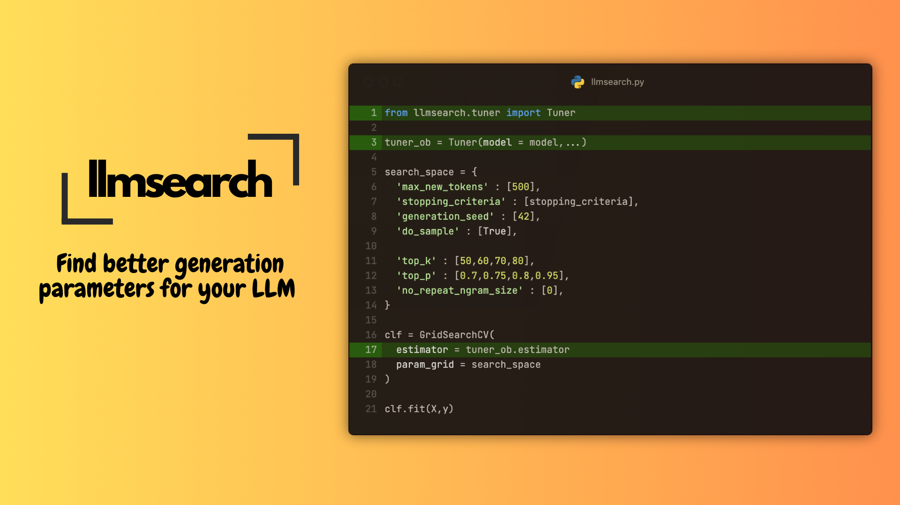

# llmsearch

This framework provides a familiar way to do a hyperparameter search over generation parameters of an LLM to find the best ones for your usecase. All you need is a model, dataset and a metric.

# Installation
The package works best with `python>=3.8.1`, `torch>=1.1` and `transformers>=4.27.4`.

Install with pip
```
pip install llmsearch
```

# Getting Started

## QuickStart

```python
# Requires accelerate==0.27.2 py7zr==0.21.0 evaluate==0.4.0 rouge_score==0.1.2

import torch
import evaluate
import datasets
import numpy as np

from llmsearch.tuner import Tuner
from sklearn.model_selection import GridSearchCV
from llmsearch.scripts.stopping_criteria import MultiTokenStoppingCriteria
from transformers import AutoTokenizer, AutoModelForCausalLM, StoppingCriteriaList

seed = 42
batch_size = 2
num_samples = 10

# Load model & tokenizer
model_id = "cognitivecomputations/dolphin-2.9-llama3-8b"
tokenizer = AutoTokenizer.from_pretrained(model_id, padding_side = "left")
model = AutoModelForCausalLM.from_pretrained(model_id, torch_dtype = torch.float16, device_map = "auto")

# Load dataset & metric
dataset = datasets.load_dataset("samsum")['train']
sample_dataset = dataset.shuffle(seed = seed).select(range(num_samples))
rouge = evaluate.load('rouge')

# Optional : Define stopping criteria, here we stop a generation of a sequence when `<|im_end|>` is reached
multi_token_stop_criteria_ob = MultiTokenStoppingCriteria(sequence_ids=[128256])
stopping_criteria = StoppingCriteriaList([multi_token_stop_criteria_ob])
# useful when batching
callbacks_after_inference = [multi_token_stop_criteria_ob.reset]

# Scorer
def get_rouge_score(y_true, y_pred):
    return np.mean(rouge.compute(predictions=y_pred, references=[item['summary'] for item in y_true], use_stemmer=True, use_aggregator=False)['rouge2'])

# To process dataset to chat format
def sample_to_chat_format(tokenizer, **kwargs):
    messages = [
        {
            'role' : "system",
            'content' : "You are Dolphin, a helpful AI assistant."
        },
        {
            'role' : "user",
            'content' : f"Summarize the following text: {kwargs['dialogue']}"
        }
    ]
    return tokenizer.apply_chat_template(messages, tokenize = False, add_generation_prompt = True)

# Define tuner object and pass in model, metric & dataset
tuner_ob = Tuner(
    model=model,
    tokenizer=tokenizer,
    dataset=sample_dataset,
    device="cuda:0",
    batch_size=batch_size,
    tokenizer_encode_args={"padding": "longest",'truncation' : True, "add_special_tokens": False, 'max_length' : 1024},
    tokenizer_decode_args={"spaces_between_special_tokens": False, 'skip_special_tokens' : True},
    scorer=get_rouge_score,
    sample_preprocessor=sample_to_chat_format,
    seed=seed,
    column_mapping={"input_cols": ["dialogue"], "eval_cols": ["summary"]},
    callbacks_after_inference=callbacks_after_inference,
)

# Check to see if dataset is processed as expected
print(tuner_ob.dataset['_X'][:2])

# Get score & outputs using arbitrary generation parameters to check performance before tuning
gen_params = {
    'max_new_tokens' : 70,
    'stopping_criteria' : stopping_criteria,
    'generation_seed' : 42,
}

score, outputs = tuner_ob.get_score(gen_params)

print(score)

# Define your hyperparameter space here for the earch
hyp_space = {
    'max_new_tokens' : [70],
    'stopping_criteria' : [stopping_criteria],
    'generation_seed' : [42],
    'do_sample' : [True],

    'temperature': [0.1,],
    'top_k': [50],
    'no_repeat_ngram_size': [0],
}

# Pass in estimator & scorer as you do with the scikit-learn API
clf = GridSearchCV(
    estimator = tuner_ob.estimator,
    param_grid=hyp_space,
    scoring = tuner_ob.scorer,
    cv = 2,
    n_jobs = None,
    verbose=3,
)

clf.fit(X=tuner_ob.dataset["_X"], y=tuner_ob.dataset['_y'])

# Get the best params
print(clf.best_params_)

# Check score on an OOS dataset, note that the same preprocessing is applied to this dataset
# tuner_ob.get_score(clf.best_params_, oos_dataset)

```

## End-to-End Model Examples
1. [GSM8K Example](https://github.com/Praful932/llmsearch/blob/main/examples/gsm8k_example.ipynb) - Shows a GridSearch ran on the GSM8K Dataset using the `TheBloke/CapybaraHermes-2.5-Mistral-7B-AWQ` model.
2. [Samsum Example](https://github.com/Praful932/llmsearch/blob/main/examples/samsum_example.ipynb) - Shows a GridSearch ran on the samsum Dataset
using a finetuned(on samsum dataset) version of `cognitivecomputations/dolphin-2.2.1-mistral-7b`.

## Recommendations
1. Running a hyperparameter search works best when results are reproducible, quantization frameworks such as exllama offer very high inference speed while trading against reprodubility. I have generally found

# Contents
- Why?
- Usage
- Benchmarks
- References

### Why?
Generation Parameters play a key role in generating output for a language model. The way the next token is sample is decided by these generation parameters. There are multiple different text generation strategies and you may not know which works best for your usecase. That's where llmsearch comes in.

### Usage